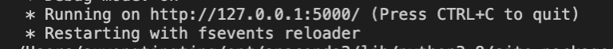

# Heart Disease Prediction Application 

The goal of this heart disease prediction project is to determine if an individual should be healthy or diagnosed with heart disease. It is done with the use of Decision Tree algorithm.
If you would like to explore on how the model is being created, you may refer to "prediction_heart_disease.ipynb".  

With the intention of allowing these individuals to access to the model with ease, a simple web application has been developed with the use of Flask, HTML and Bootstrap. 

# 1. Getting Started
  - Step 1 : Download the respective files 
  - Step 2 : Based on your operating systems, switch on WampServer/MAMP 
  - Step 3 : Enter "python app.py" into command prompt/terminal to run the file app.py 
  - Step 4 : Based on the output given, enter http://127.0.0.1:5000/ into your browser

    

# 2. Data 

The dataset consists of a total of 14 features and 303 rows. This dataset is found on Kaggle (https://www.kaggle.com/ronitf/heart-disease-uci), originated from UCI Heart Disease (https://archive.ics.uci.edu/ml/datasets/Heart+Disease). 

# 3. Features
    1. age 
    2. sex 
    -- 0 represents female 
    -- 1 represents male 
    3. chest pain type (cp)
    -- 0 represents typical angina 
    -- 1 represents atypical angina 
    -- 2 represents non-anginal pain 
    -- 3 represents asymptomatic        
    4. resting blood pressure (trestbps)
    5. serum cholesterol in mg/dl (chol)
    6. fasting blood sugar > 120 mg/dl (fbs) 
    -- 0 represents < 120 mg/dl 
    -- 1 represents > 120 mg/dl 
    7. resting electrocardiographic results (restecg)
    -- 0 represents normal 
    -- 1 represents having ST-T wave abnormality (T wave inversions and/or ST elevation or depression of > 0.05 mV) 
    -- 2 represents showing probable or definite left ventricular hypertrophy by Estes' criteria 
    8. maximum heart rate achieved (thalach)
    9. exercise induced angina (exang) 
    10. old peak = ST depression induced by exercise relative to rest (oldpeak)
    11. the slope of the peak exercise ST segment (slope)
    -- 0 represents upsloping
    -- 1 represents flat
    -- 2 represents downsloping
    12. number of major vessels (0-4) colored by flourosopy (ca)
    13. thal
    -- 0 represents unknown 
    -- 1 represents normal 
    -- 2 represents fixed defect 
    -- 3 represents reversable defect

## Target 
    14. presence of heart disease (yes/no)
    -- 1 represents yes 
    -- 0 represents no